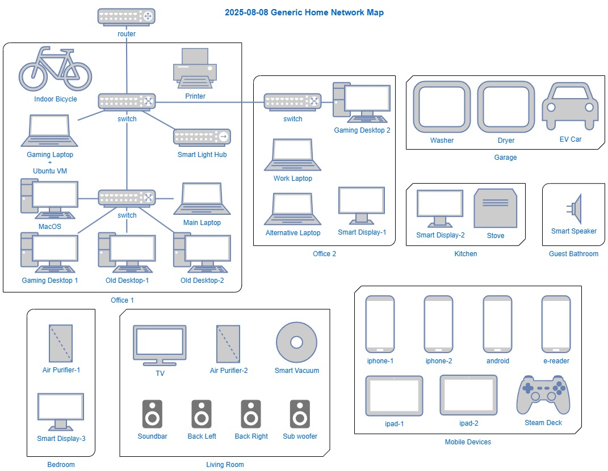

# Chapter 1 – Base Linux System and Network Map

## 🎯 Objective
I will be setting up a base Ubuntu virtual machine which will be used to install and run security tools throughout these labs. I will also be creating a network map, and it will be generic. However, I am willing to show more details to a hiring manager.

### 💡 Skills Practiced
- Virtual machine creation
- Linux installation and package management
- Secure SSH configuration
- Network topology mapping

### 🛠️ Tools Used
- Ubuntu 24.04.2 LTS
- VMware Workstation 17 Pro
- OpenSSH server
- Draw.io for network map

## 🧪 Lab Steps
1. Created an Ubuntu VM using VMware Workstation. VMware already installed.
2. Updated system and installed essential packages: `sudo apt update && sudo apt upgrade`.
3. Removed no longer needed dependencies and previously downloaded packages: `sudo apt autoremove && sudo apt clean`
4. Configured SSH key-based login, disabled password auth, and disabled root login.
   - `ssh-keygen` as instructed does create a SSH key pair on Windows, and `ssh-copy-id` did not work as instructed on Windows 11.
      - As a quick workaround, I remotely logged in using SSH from Windows client to the Ubuntu ssh server, and copied the public key from `C:\Users\<user>\.ssh\id_ed25519.pub` into `~/.ssh/authorized_keys`.
      - I this article from Microsoft on [OpenSSH Key Management](https://learn.microsoft.com/en-us/windows-server/administration/openssh/openssh_keymanagement), but I haven't read through it.
5. Create snapshot of VM after configurations.
6. Logged into ISP router to review to find IP address range in DHCP settings.
7. Start an asset inventory.
8. Drew a generic network map using Draw.io. (Keeping it generic for the public eye)

### 📸 Artifacts
**Network Map**

### 🔗 References
- Microsoft Learn: [OpenSSH Key Management](https://learn.microsoft.com/en-us/windows-server/administration/openssh/openssh_keymanagement)
- Antisyphon Training YouTube: [Understanding VMWare Virtual Networks](https://youtu.be/qBoBu1gF5ZY?si=OzI5GpcNbEsqzucv)

## 📘 Lessons Learned
- Learned the difference between bridged and NAT networking in VMs.
- `ssh-copy-id` script does not work on Windows.
- SSH key login is significantly more secure than passwords.
- Creating a visual network map gave me clarity on my home network.

### ❓ Follow-up questions, projects, and research
- Try creating the same setup in a cloud provider like AWS.
- Learn more about LVM and other options for disks and partitioning when installing Linux to understand the differences.
- Review different SSH keys available from `ssh-keygen`.
- Review the MS OpenSSH Key Management article for a smoother experience with copying a public key remotely.

## 🙃 Bonus Afterthought Activity
I did a little more than the book asked for by running `nmap` a few different times. Surely, looking at the device list on my router would've been enough, but it was hard to analyze even after dropping details into a spreadsheet and cleaning it up. I built out my Network Map from "memory" room by room, and this all proved to be flawed memory because I missed a a handful of devices. I will leave the former network map as a reminder of this, and adding a corrected network map. "You can't protect what you don't know you have." Thanks for humbling me `nmap`.